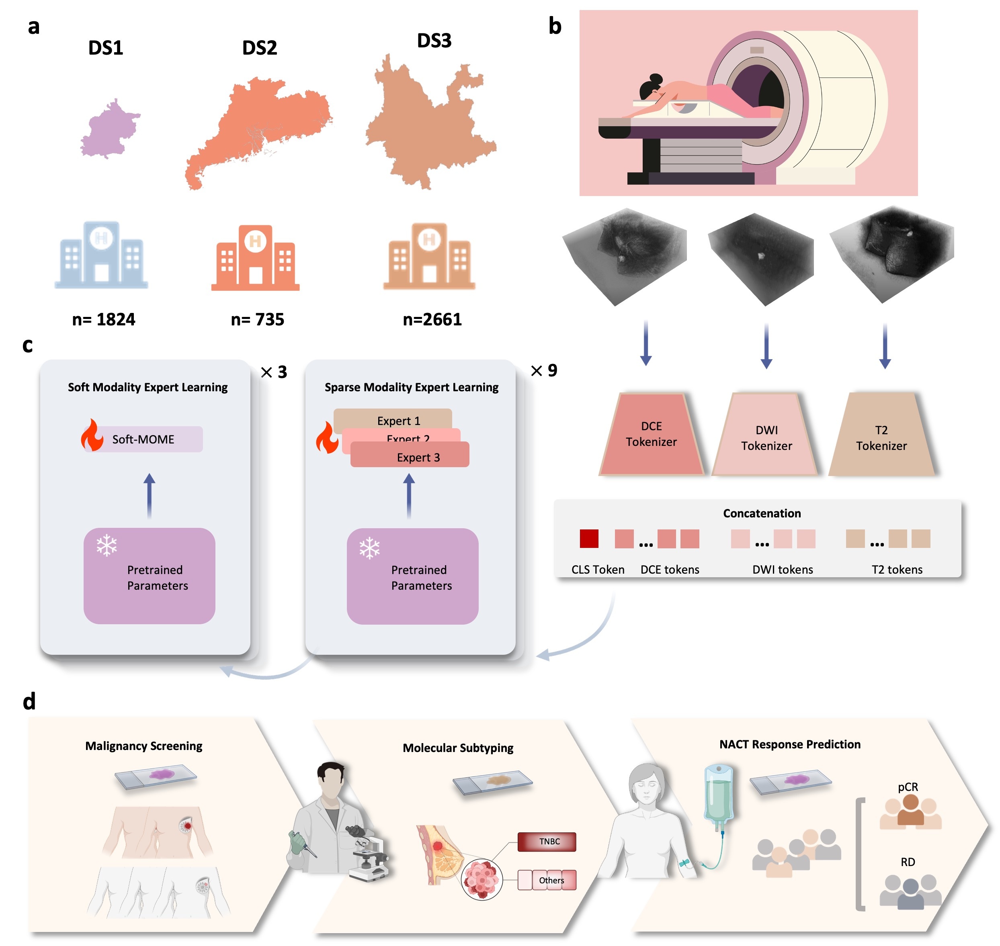

<!-- ## A large model for non-invasive and personalized management of breast cancer from multiparametric MRI-->

--- 

# Towards Non-invasive and Personalized Management of Breast Cancer Patients from Multiparametric MRI via A Large Mixture-of-Modality-Experts Model



# Model Card for MOME
MOME conducts multimodel fusion and classification based on multi-sequence 3D medical data, e.g., multiparametric breast MRI.

## Model Details

### Model Description

<!-- Provide a longer summary of what this model is. -->


- **Developed by:** Luyang Luo
- **Model type:** Transformer (based on BEiT3)
- **License:** MIT
- **Finetuned from model :** BEiT-3
- **Repository:** https://github.com/LLYXC/MOME
- **Paper:** Towards Non-invasive and Personalized Management of Breast Cancer Patients from Multiparametric MRI via A Large Mixture-of-Modality-Experts Model

## Uses

<!-- Address questions around how the model is intended to be used, including the foreseeable users of the model and those affected by the model. -->
- **Requirement/dependencies:** Please see the requirement of [BEiT-3](https://github.com/microsoft/unilm/tree/master/beit3).
- **Installation:** The installation will take a few seconds to minutes.
```
git clone https://github.com/LLYXC/MOME.git
mkdir log
```
- **[Sample Data](https://drive.google.com/drive/folders/1ja5OQJZCkDkTBMZorNt-hq1gVDH2dKWa?usp=sharing)** 
- **Training and Testing:** The training and testing commands are provided in [scripts](scripts). Make a directory for the dataset, and use the csv file provided above to load the dataset.
- **Expected output:** The model will generate probabilities for each sample, and the expected run time on an NVIDIA GeForce RTX 3090 GPU will be less than one minute.

## Citation
### If you found our work useful, please consider cite the following:
```
@article{luo2025large,
  title={A large model for non-invasive and personalized management of breast cancer from multiparametric MRI},
  author={Luo, Luyang and Wu, Mingxiang and Li, Mei and Xin, Yi and Wang, Qiong and Vardhanabhuti, Varut and Chu, Winnie CW and Li, Zhenhui and Zhou, Juan and Rajpurkar, Pranav and others},
  journal={Nature Communications},
  volume={16},
  number={1},
  pages={3647},
  year={2025},
  publisher={Nature Publishing Group UK London}
}
```

### Our work is standing on the sholders of [BEiT-3](https://github.com/microsoft/unilm/tree/master/beit3) and [soft MOE](https://github.com/bwconrad/soft-moe), please also consider cite the following works:
```
@inproceedings{wang2023image,
title={Image as a foreign language: Beit pretraining for vision and vision-language tasks},
author={Wang, Wenhui and Bao, Hangbo and Dong, Li and Bjorck, Johan and Peng, Zhiliang and Liu, Qiang and Aggarwal, Kriti and Mohammed, Owais Khan and Singhal, Saksham and Som, Subhojit and others},
booktitle={Proceedings of the IEEE/CVF Conference on Computer Vision and Pattern Recognition},
pages={19175--19186},
year={2023}
}
```
```
@inproceedings{puigcerversparse,
  title={From Sparse to Soft Mixtures of Experts},
  author={Puigcerver, Joan and Ruiz, Carlos Riquelme and Mustafa, Basil and Houlsby, Neil},
  booktitle={The Twelfth International Conference on Learning Representations}
}
```
